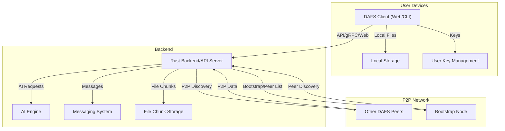

# DAFS - Decentralized Authenticated File System

[//]: # (Badges)
<!-- Add build, test, and coverage badges here if CI is set up -->

---

**Documentation:**
- [Features Guide](FEATURES_GUIDE.md)
- [Setup Guide](SETUP_GUIDE.md)
- [Quickstart](QUICKSTART.md)
- [CLI Usage](CLI_USAGE.md)
- [API Reference](docs/API.md)
- [Integration Guide](INTEGRATION.md)
- [Bootstrap Node Management](BOOTSTRAP_NODE_MANAGEMENT.md)
- [FAQ](FAQ.md)
- [Contributing](CONTRIBUTING.md)
- [Code of Conduct](CODE_OF_CONDUCT.md)

---

## 🏗️ Architecture Overview



---

## 🎯 What is DAFS?

DAFS (Decentralized Authenticated File System) is a revolutionary file storage and sharing system that combines the power of blockchain-like decentralization with modern AI capabilities. Think of it as a combination of Dropbox, WhatsApp, and a private social network, all running on your own devices without needing central servers.

### 🌟 Why DAFS is Special

**Traditional cloud storage** (like Google Drive, Dropbox):
- Your files are stored on someone else's servers
- You depend on internet connectivity
- Your privacy depends on trusting big companies
- You pay monthly fees for storage

**DAFS decentralized storage**:
- Your files are stored across a network of trusted peers
- Works even with limited internet connectivity
- You control your own privacy and data
- Free to use (you just need to contribute storage to the network)
- Built-in encrypted messaging and AI-powered file recommendations

## 🏗️ How DAFS Works (Simple Explanation)

Imagine you have a group of friends who all want to share files securely:

1. **Your Device**: You install DAFS on your computer/phone
2. **Network**: DAFS automatically finds other DAFS users on your network and the internet
3. **Storage**: When you upload a file, it gets split into pieces and stored across multiple devices
4. **Security**: Everything is encrypted so only you and people you choose can see your files
5. **Messaging**: You can chat with other users through the same system
6. **AI**: The system learns from your file usage and suggests relevant files

## 🚀 Getting Started (Complete Beginner Guide)

### Step 1: Install Prerequisites

Before you can use DAFS, you need to install some software on your computer:

#### For Windows Users:
1. **Install Rust**: Download from https://rustup.rs/ and run the installer
2. **Install Node.js**: Download from https://nodejs.org/ (choose the LTS version)
3. **Install Git**: Download from https://git-scm.com/

#### For macOS Users:
1. **Install Homebrew** (if you don't have it):
   ```bash
   /bin/bash -c "$(curl -fsSL https://raw.githubusercontent.com/Homebrew/install/HEAD/install.sh)"
   ```
2. **Install Rust**:
   ```bash
   curl --proto '=https' --tlsv1.2 -sSf https://sh.rustup.rs | sh
   ```
3. **Install Node.js**:
   ```bash
   brew install node
   ```
4. **Install Git**:
   ```bash
   brew install git
   ```

#### For Linux Users (Ubuntu/Debian):
```bash
# Update your system
sudo apt update && sudo apt upgrade -y

# Install Rust
curl --proto '=https' --tlsv1.2 -sSf https://sh.rustup.rs | sh
source ~/.cargo/env

# Install Node.js
curl -fsSL https://deb.nodesource.com/setup_18.x | sudo -E bash -
sudo apt install -y nodejs

# Install Git
sudo apt install git

# Install build tools
sudo apt install build-essential
```

#### For Linux Users (Arch Linux):
```bash
# Install Rust
sudo pacman -S rust

# Install Node.js
sudo pacman -S nodejs npm

# Install Git
sudo pacman -S git

# Install build tools
sudo pacman -S base-devel
```

### Step 2: Download and Build DAFS

1. **Open Terminal/Command Prompt** on your computer

2. **Navigate to where you want to install DAFS**:
   ```bash
   cd ~/Documents  # or wherever you prefer
   ```

3. **Download DAFS**:
   ```bash
   git clone https://github.com/your-username/dafs.git
   cd dafs
   ```

4. **Build DAFS** (this might take 5-10 minutes the first time):
   ```bash
   cargo build --release
   ```

5. **Set up the web interface**:
   ```bash
   cd web
   npm install
   npm run build
   cd ..
   ```

### Step 3: Start DAFS for the First Time

1. **Start DAFS**:
   ```bash
   ./target/release/dafs
   ```

2. **You should see something like this**:
   ```
   🚀 Starting DAFS node in integrated mode...
   ✅ DAFS node started in integrated mode!
      HTTP API: http://127.0.0.1:6543
      gRPC: grpc://[::1]:50051
      Web Dashboard: Use 'dafs cli startweb' to start
      Use Ctrl+C to stop
   ```

3. **In a new terminal window, start the web dashboard**:
   ```bash
   ./target/release/dafs cli startweb
   ```

4. **Open your web browser** and go to: `http://localhost:3093`

## 👤 Creating Your First Account

### Option 1: Using the Web Interface (Easiest)

1. **Open your browser** to `http://localhost:3093`
2. **Click "Register"** in the top right
3. **Fill in your details**:
   - Username: Choose a unique username (e.g., "alice")
   - Display Name: Your real name (e.g., "Alice Johnson")
   - Email: Your email address (optional)
4. **Click "Register"**
5. **You're now logged in!**

### Option 2: Using the Command Line

1. **Open a new terminal window**
2. **Register a new user**:
   ```bash
   ./target/release/dafs cli register-user "alice" "Alice Johnson" "alice@example.com"
   ```
3. **Login**:
   ```bash
   ./target/release/dafs cli login-user "alice"
   ```

## 📁 Your First File Upload

### Using the Web Interface:

1. **In your browser**, click on the **"Files"** tab
2. **Click "Upload File"**
3. **Select a file** from your computer (any file will work)
4. **Add some tags** (optional) - these help organize your files:
   - For a work document: `work`, `important`
   - For a photo: `photos`, `family`
   - For a video: `videos`, `fun`
5. **Choose privacy settings**:
   - **Private**: Only you can see it
   - **Shared**: You can share it with specific people
   - **Public**: Anyone on the network can see it (not recommended for personal files)
6. **Click "Upload"**
7. **Wait for the upload to complete** (you'll see a progress bar)

### Using the Command Line:

```bash
# Upload a file with tags
./target/release/dafs cli upload "my_document.pdf" "work" "important"

# List your files
./target/release/dafs cli files

# Download a file
./target/release/dafs cli download "file_1234567890"
```

## 🌐 Connecting with Other Users

### Finding Other DAFS Users

DAFS automatically finds other users in several ways:

1. **Local Network**: Automatically finds other DAFS users on your WiFi network
2. **Internet Discovery**: Finds users across the internet using a special network
3. **Bootstrap Nodes**: Connects to trusted servers that help find other users
4. **Manual Connection**: Connect directly to someone you know

### Using the Web Interface:

1. **Click on "Peer Discovery"** in the navigation
2. **Click "Discover Peers"** to find users on the network
3. **Click "Scan Local Network"** to find users on your WiFi
4. **You'll see a list of discovered users**

### Using the Command Line:

```bash
# Discover peers on the network
./target/release/dafs cli discover-peers

# Scan your local network
./target/release/dafs cli scan-local-peers

# List all known peers
./target/release/dafs cli list-known-peers

# Connect to a specific peer (if you know their ID)
./target/release/dafs cli connect-peer "QmPeerId123..."
```

## 💬 Sending Your First Message

### Using the Web Interface:

1. **Click on "Messaging"** in the navigation
2. **You'll see a list of users** on the left side
3. **Click on a user** to start chatting
4. **Type your message** in the text box at the bottom
5. **Press Enter** to send

### Using the Command Line:

```bash
# Send a direct message
./target/release/dafs cli send-message "bob" "Hello! How are you?"

# Start the interactive messaging shell
./target/release/dafs cli messaging-shell
```

### Interactive Messaging Shell

The messaging shell is like a chat app in your terminal:

```bash
./target/release/dafs cli messaging-shell
```

**Available commands in the shell:**
- `send alice Hello there!` - Send a message to Alice
- `peers list` - See all available users
- `status set Working on project` - Set your status
- `room create Team Chat alice bob` - Create a group chat
- `help` - See all available commands
- `exit` - Leave the messaging shell

## 🤖 AI-Powered Features

DAFS includes artificial intelligence that learns from your file usage:

### Getting File Recommendations

1. **Upload several files** with different tags
2. **Go to "AI Operations"** in the web interface
3. **Click "Train Model"** to teach the AI about your files
4. **Click "Get Recommendations"** to see AI suggestions

### Using the Command Line:

```bash
# Train the AI model with your files
./target/release/dafs cli train-ai

# Get AI recommendations
./target/release/dafs cli get-recommendations
```

## 🔧 Advanced Features

### Chat Rooms (Group Chats)

Create group conversations with multiple users:

```bash
# Create a chat room
./target/release/dafs cli create-room "Project Team" "alice" "bob" "charlie"

# Join an existing room
./target/release/dafs cli join-room "room_1234567890"

# Send a message to the room
./target/release/dafs cli send-room-message "room_1234567890" "Hello everyone!"
```

### File Sharing

Share files with specific users:

```bash
# Share a file with a user
./target/release/dafs cli share "file_1234567890" "bob"

# List files shared with you
./target/release/dafs cli shared-files
```

### User Management

Manage your account and devices:

```bash
# Change your username
./target/release/dafs cli change-username "alice_new"

# See all your devices
./target/release/dafs cli list-devices

# Remove a device (if you lost your phone, etc.)
./target/release/dafs cli remove-device "device_1234567890"

# Search for other users
./target/release/dafs cli search-users "bob"
```

### Bootstrap Nodes (Advanced)

Bootstrap nodes help you find other users on the internet:

```bash
# Add a bootstrap node (you'll get these from other DAFS users)
./target/release/dafs cli add-bootstrap "QmBootstrapPeer" "/ip4/1.2.3.4/tcp/2093"

# List your bootstrap nodes
./target/release/dafs cli list-bootstrap

# Remove a bootstrap node
./target/release/dafs cli remove-bootstrap "QmBootstrapPeer"
```

## 🛠️ Troubleshooting

### DAFS Won't Start

**Problem**: You get an error when trying to start DAFS

**Solutions**:
1. **Check if ports are in use**:
   ```bash
   # On Linux/macOS
   netstat -tulpn | grep :6543
   netstat -tulpn | grep :50051
   
   # On Windows
   netstat -an | findstr :6543
   netstat -an | findstr :50051
   ```

2. **Kill processes using the ports**:
   ```bash
   # On Linux/macOS
   sudo kill -9 $(lsof -t -i:6543)
   sudo kill -9 $(lsof -t -i:50051)
   ```

3. **Check if you have the right permissions**:
   ```bash
   chmod +x target/release/dafs
   ```

### Can't Find Other Users

**Problem**: You're not seeing other DAFS users

**Solutions**:
1. **Make sure you're on the same network** (for local discovery)
2. **Try manual discovery**:
   ```bash
   ./target/release/dafs cli discover-peers
   ```
3. **Add bootstrap nodes** (ask other DAFS users for their node addresses)
4. **Check your firewall** - make sure ports 2093, 6543, and 50051 are open

### Web Interface Won't Load

**Problem**: Browser shows an error when accessing the web dashboard

**Solutions**:
1. **Make sure the web dashboard is running**:
   ```bash
   ./target/release/dafs cli startweb
   ```
2. **Check the URL**: Make sure you're going to `http://localhost:3093`
3. **Try a different browser**
4. **Clear your browser cache**

### Files Won't Upload

**Problem**: File uploads fail or are very slow

**Solutions**:
1. **Check your internet connection**
2. **Try a smaller file first** (under 1MB)
3. **Check available disk space**:
   ```bash
   df -h
   ```
4. **Restart DAFS**:
   ```bash
   # Stop DAFS (Ctrl+C)
   # Then start it again
   ./target/release/dafs
   ```

## 📚 Complete Command Reference

### Basic Commands
```bash
./target/release/dafs cli --help                    # Show all commands
./target/release/dafs cli --version                 # Show version
./target/release/dafs cli start                     # Start all services
./target/release/dafs cli stop                      # Stop all services
./target/release/dafs cli startweb                  # Start web dashboard
./target/release/dafs cli startapi                  # Start API server
```

### User Management
```bash
./target/release/dafs cli register-user "username" "Display Name" "email"
./target/release/dafs cli login-user "username"
./target/release/dafs cli logout-device
./target/release/dafs cli who-am-i
./target/release/dafs cli list-all-users
./target/release/dafs cli search-users "query"
./target/release/dafs cli change-username "new_username"
./target/release/dafs cli list-devices
./target/release/dafs cli remove-device "device_id"
```

### File Operations
```bash
./target/release/dafs cli upload "file.txt" "tag1" "tag2"
./target/release/dafs cli download "file_id"
./target/release/dafs cli files
./target/release/dafs cli share "file_id" "username"
./target/release/dafs cli p2p-files
./target/release/dafs cli p2p-download "file_id" "peer_id"
```

### Peer Discovery
```bash
./target/release/dafs cli discover-peers
./target/release/dafs cli scan-local-peers
./target/release/dafs cli list-known-peers
./target/release/dafs cli connect-peer "peer_id"
./target/release/dafs cli ping-peer "peer_id"
./target/release/dafs cli remove-peer "peer_id"
./target/release/dafs cli add-bootstrap "peer_id" "address"
./target/release/dafs cli list-bootstrap
./target/release/dafs cli remove-bootstrap "peer_id"
./target/release/dafs cli peer-history
```

### Messaging
```bash
./target/release/dafs cli messaging-shell
./target/release/dafs cli send-message "username" "message"
./target/release/dafs cli create-room "name" "user1" "user2"
./target/release/dafs cli join-room "room_id"
./target/release/dafs cli send-room-message "room_id" "message"
./target/release/dafs cli list-rooms
./target/release/dafs cli list-messages "room_id"
./target/release/dafs cli set-status "status message"
./target/release/dafs cli list-users
```

### AI Features
```bash
./target/release/dafs cli train-ai
./target/release/dafs cli get-recommendations
./target/release/dafs cli export-model "model_name"
./target/release/dafs cli import-model "model_file"
```

## 🔒 Security and Privacy

### How DAFS Protects Your Data

1. **End-to-End Encryption**: All messages and files are encrypted before they leave your device
2. **No Central Server**: Your data never goes through a central server that could be hacked
3. **User Authentication**: Only users you approve can access your shared files
4. **Device Management**: You can see and control all devices that access your account
5. **Session Management**: Secure login sessions with automatic logout

### Best Practices

1. **Use Strong Usernames**: Don't use your real name as your username
2. **Keep Your Device Secure**: Use a password on your computer/phone
3. **Be Careful with Sharing**: Only share files with people you trust
4. **Regular Updates**: Keep DAFS updated for security patches
5. **Backup Important Files**: Don't rely solely on DAFS for critical files

## 🌍 Network Architecture

### How DAFS Finds Other Users

1. **Local Network (mDNS)**: Automatically finds DAFS users on your WiFi network
2. **Distributed Hash Table (DHT)**: Finds users across the internet using a peer-to-peer network
3. **Bootstrap Nodes**: Connects to trusted servers that help find other users
4. **Manual Connection**: Direct connection to users you know

### Network Ports

DAFS uses these ports:
- **2093**: P2P communication between nodes
- **6543**: Web API for the dashboard
- **50051**: gRPC for high-performance communication
- **3093**: Web dashboard interface

### Firewall Configuration

If you're behind a firewall, you may need to open these ports:
- **TCP 2093**: For P2P communication
- **TCP 6543**: For web API
- **TCP 50051**: For gRPC
- **TCP 3093**: For web dashboard

## 🚀 Advanced Configuration

### Configuration Files

DAFS stores configuration in several files:
- `bootstrap_nodes.json`: List of trusted bootstrap nodes
- `discovered_peers.json`: Peers you've discovered
- `users/`: User account data
- `device_memory/`: Device-specific peer memory
- `files/`: Local file storage

### Customizing DAFS

You can customize DAFS behavior by editing configuration files or using environment variables:

```bash
# Set custom ports
export DAFS_API_PORT=8080
export DAFS_GRPC_PORT=50052
export DAFS_WEB_PORT=3000

# Start DAFS with custom settings
./target/release/dafs
```

## 🤝 Contributing to DAFS

### How to Help

1. **Report Bugs**: If you find a problem, report it on GitHub
2. **Suggest Features**: Share ideas for new features
3. **Help Others**: Answer questions in the community
4. **Contribute Code**: If you're a programmer, help improve DAFS

### Development Setup

If you want to help develop DAFS:

```bash
# Clone the repository
git clone https://github.com/your-username/dafs.git
cd dafs

# Install development dependencies
cargo install cargo-watch
cargo install cargo-audit

# Run tests
cargo test

# Check code quality
cargo clippy
cargo audit

# Run in development mode
cargo run
```

## 📞 Getting Help

### Where to Find Help

1. **GitHub Issues**: Report bugs and request features
2. **GitHub Discussions**: Ask questions and share ideas
3. **Documentation**: Read the detailed guides
4. **Community**: Join the DAFS community

### Common Questions

**Q: Is DAFS free to use?**
A: Yes! DAFS is completely free and open source.

**Q: Do I need internet to use DAFS?**
A: You need internet to find other users, but once connected, you can share files locally.

**Q: Is my data safe?**
A: Yes, all data is encrypted and never stored on central servers.

**Q: Can I use DAFS on my phone?**
A: Currently DAFS runs on computers, but mobile support is planned.

**Q: What happens if I lose my device?**
A: You can log in from another device and access your files (if they were shared).

## 📄 License

DAFS is licensed under the MIT License, which means you can use it freely for personal and commercial purposes.

## 🙏 Acknowledgments

DAFS was built using many open-source technologies:
- **Rust**: For the backend system
- **React**: For the web interface
- **libp2p**: For peer-to-peer networking
- **SQLite**: For local data storage
- **And many more**: See the full list in Cargo.toml

---

**Welcome to the decentralized future of file sharing!** 🚀

Start exploring DAFS today and discover a new way to share files, communicate, and collaborate without relying on big tech companies.
