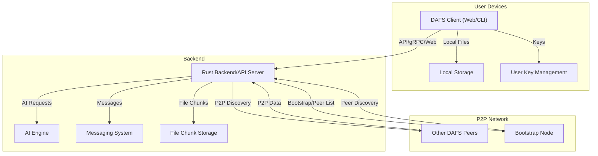

# DAFS - Decentralized Authenticated File System

[//]: # (Badges)
<!-- Add build, test, and coverage badges here if CI is set up -->

---

**Documentation:**
- [Features Guide](FEATURES_GUIDE.md)
- [Setup Guide](SETUP_GUIDE.md)
- [Quickstart](QUICKSTART.md)
- [CLI Usage](CLI_USAGE.md)
- [API Reference](docs/API.md)
- [Integration Guide](INTEGRATION.md)
- [Bootstrap Node Management](BOOTSTRAP_NODE_MANAGEMENT.md)
- [FAQ](FAQ.md)
- [Contributing](CONTRIBUTING.md)
- [Code of Conduct](CODE_OF_CONDUCT.md)

---

## 🏗️ Architecture Overview



---

## 🎯 What is DAFS?

DAFS (Decentralized Authenticated File System) is a revolutionary file storage and sharing system that combines the power of blockchain-like decentralization with modern AI capabilities. Think of it as a combination of Dropbox, WhatsApp, and a private social network, all running on your own devices without needing central servers.

### 🌟 Why DAFS is Special

**Traditional cloud storage** (like Google Drive, Dropbox):
- Your files are stored on someone else's servers
- You depend on internet connectivity
- Your privacy depends on trusting big companies
- You pay monthly fees for storage

**DAFS decentralized storage**:
- Your files are stored across a network of trusted peers
- Works even with limited internet connectivity
- You control your own privacy and data
- Free to use (you just need to contribute storage to the network)
- Built-in encrypted messaging and AI-powered file recommendations

## 🏗️ How DAFS Works (Simple Explanation)

Imagine you have a group of friends who all want to share files securely:

1. **Your Device**: You install DAFS on your computer/phone
2. **Network**: DAFS automatically finds other DAFS users on your network and the internet
3. **Storage**: When you upload a file, it gets split into pieces and stored across multiple devices
4. **Security**: Everything is encrypted so only you and people you choose can see your files
5. **Messaging**: You can chat with other users through the same system
6. **AI**: The system learns from your file usage and suggests relevant files

## 🚀 Getting Started (Complete Beginner Guide)

### Step 1: Install Prerequisites

Before you can use DAFS, you need to install some software on your computer:

#### For Windows Users:
1. **Install Rust**: Download from https://rustup.rs/ and run the installer
2. **Install Node.js**: Download from https://nodejs.org/ (choose the LTS version)
3. **Install Git**: Download from https://git-scm.com/

#### For macOS Users:
1. **Install Homebrew** (if you don't have it):
   ```bash
   /bin/bash -c "$(curl -fsSL https://raw.githubusercontent.com/Homebrew/install/HEAD/install.sh)"
   ```
2. **Install Rust**:
   ```bash
   curl --proto '=https' --tlsv1.2 -sSf https://sh.rustup.rs | sh
   ```
3. **Install Node.js**:
   ```bash
   brew install node
   ```
4. **Install Git**:
   ```bash
   brew install git
   ```

#### For Linux Users (Ubuntu/Debian):
```bash
# Update your system
sudo apt update && sudo apt upgrade -y

# Install Rust
curl --proto '=https' --tlsv1.2 -sSf https://sh.rustup.rs | sh
source ~/.cargo/env

# Install Node.js
curl -fsSL https://deb.nodesource.com/setup_18.x | sudo -E bash -
sudo apt install -y nodejs

# Install Git
sudo apt install git

# Install build tools
sudo apt install build-essential
```

#### For Linux Users (Arch Linux):
```bash
# Install Rust
sudo pacman -S rust

# Install Node.js
sudo pacman -S nodejs npm

# Install Git
sudo pacman -S git

# Install build tools
sudo pacman -S base-devel
```

### Step 2: Download and Build DAFS

1. **Open Terminal/Command Prompt** on your computer

2. **Navigate to where you want to install DAFS**:
   ```bash
   cd ~/Documents  # or wherever you prefer
   ```

3. **Download DAFS**:
   ```bash
   git clone https://github.com/Kyle6012/dafs.git
   cd dafs
   ```

4. **Build DAFS** (this might take 5-10 minutes the first time):
   ```bash
   cargo build --release
   ```

5. **Set up the web interface**:
   ```bash
   cd web
   npm install
   npm run build
   cd ..
   ```

### Step 3: Start DAFS for the First Time

1. **Start DAFS with web dashboard**:
   ```bash
   ./target/release/dafs --web
   ```

2. **You should see something like this**:
   ```
   🚀 Starting DAFS services...
   ✅ HTTP API server started on port 6543
   ✅ gRPC server started on port 50051
   ✅ Web dashboard server started on port 3093
   ✅ P2P network started on port 2093
   ```

3. **Open your web browser** and go to: `http://localhost:3093`

### Alternative: Using the Interactive CLI

1. **Start the interactive CLI**:
   ```bash
   ./target/release/dafs --cli
   ```

2. **You'll see the DAFS interactive shell**:
   ```
   🚀 DAFS - Decentralized Authenticated File System
   Welcome to DAFS Interactive Shell!
   Type 'help' for available commands, 'exit' to quit.
   
   dafs(guest)> 
   ```

3. **Start the web dashboard from the CLI**:
   ```
   dafs(guest)> startweb
   ```

## 👤 Creating Your First Account

### Option 1: Using the Web Interface (Easiest)

1. **Open your browser** to `http://localhost:3093`
2. **Click "Register"** in the top right
3. **Fill in your details**:
   - Username: Choose a unique username (e.g., "alice")
   - Display Name: Your real name (e.g., "Alice Johnson")
   - Email: Your email address (optional)
4. **Click "Register"**
5. **You're now logged in!**

### Option 2: Using the Command Line

1. **Open a new terminal window**
2. **Start the interactive CLI**:
   ```bash
   ./target/release/dafs --cli
   ```
3. **Register a new user**:
   ```
   dafs(guest)> register alice
   Password: [enter your password]
   ```
4. **Login**:
   ```
   dafs(guest)> login alice
   Password: [enter your password]
   ```

### Option 3: Using Direct Commands

```bash
# Register a new user
./target/release/dafs register alice

# Login
./target/release/dafs login alice
```

## 📁 Your First File Upload

### Using the Web Interface:

1. **In your browser**, click on the **"Files"** tab
2. **Click "Upload File"**
3. **Select a file** from your computer (any file will work)
4. **Add some tags** (optional) - these help organize your files:
   - For a work document: `work`, `important`
   - For a photo: `photos`, `family`
   - For a video: `videos`, `fun`
5. **Choose privacy settings**:
   - **Private**: Only you can see it
   - **Shared**: You can share it with specific people
   - **Public**: Anyone on the network can see it (not recommended for personal files)
6. **Click "Upload"**
7. **Wait for the upload to complete** (you'll see a progress bar)

### Using the Interactive CLI:

```bash
# Start the CLI
./target/release/dafs --cli

# Upload a file with tags
dafs(guest)> upload my_document.pdf --tags work important

# List your files
dafs(guest)> files

# Download a file
dafs(guest)> download file_1234567890
```

### Using Direct Commands:

```bash
# Upload a file with tags
./target/release/dafs upload my_document.pdf --tags work important

# List your files
./target/release/dafs files

# Download a file
./target/release/dafs download file_1234567890
```

## 🔧 CLI Commands Overview

DAFS provides a comprehensive command-line interface with the following main categories:

### Service Management
- `dafs --web` - Start all services with web dashboard
- `dafs --cli` - Start interactive CLI shell
- `dafs startweb` - Start web dashboard server
- `dafs stopweb` - Stop web dashboard server
- `dafs startapi` - Start HTTP API server
- `dafs stopapi` - Stop HTTP API server
- `dafs startgrpc` - Start gRPC server
- `dafs stopgrpc` - Stop gRPC server

### Authentication
- `dafs register <username>` - Register new user account
- `dafs login <username>` - Login with username
- `dafs logout` - Logout from current session

### File Operations
- `dafs upload <file> --tags <tag1> <tag2>...` - Upload file with tags
- `dafs download <file_id>` - Download file by ID
- `dafs share <file_id> <username>` - Share file with user
- `dafs files` - List all files

### Peer Management
- `dafs peers` - List known peers
- `dafs addbootstrap <peer> <addr>` - Add bootstrap node
- `dafs removebootstrap <peer>` - Remove bootstrap node
- `dafs listbootstrap` - List all bootstrap nodes

### AI Operations
- `dafs aitrain` - Train AI recommendation model
- `dafs airecommend <user_id>` - Get file recommendations
- `dafs aiaggregate <model_path>` - Aggregate remote model
- `dafs aiexport <output_path>` - Export local AI model

### Interactive Shell Commands
When using `dafs --cli`, you have access to all the above commands plus:
- `help` - Show comprehensive help
- `clear` - Clear screen
- `exit` or `quit` - Exit shell

For a complete list of commands, run `dafs --cli` and type `help`.

## 🌐 Repository Information

- **Repository**: https://github.com/Kyle6012/dafs
- **Documentation**: See the links at the top of this README
- **Issues**: https://github.com/Kyle6012/dafs/issues
- **Discussions**: https://github.com/Kyle6012/dafs/discussions

## 🤝 Contributing

We welcome contributions! Please see [CONTRIBUTING.md](CONTRIBUTING.md) for details on how to contribute to DAFS.

## 📄 License

This project is licensed under the MIT License - see the [LICENSE](LICENSE) file for details.

## 🆘 Support

- **Documentation**: Check the documentation links above
- **FAQ**: See [FAQ.md](FAQ.md) for common questions
- **Issues**: Report bugs at https://github.com/Kyle6012/dafs/issues
- **Discussions**: Ask questions at https://github.com/Kyle6012/dafs/discussions

---

**DAFS** - Decentralized Authenticated File System  
**Repository**: https://github.com/Kyle6012/dafs
